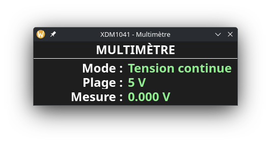

# XDM1041 - Interface Graphique Python

🇫🇷 Interface graphique en temps réel pour le multimètre **OWON XDM1041**, écrite en Python avec **PyQt6**.  
🇬🇧 Real-time graphical interface for the **OWON XDM1041** multimeter, written in Python using **PyQt6**.

## 🇫🇷 Fonctionnalités / 🇬🇧 Features

- Connexion série avec commandes SCPI / Serial SCPI connection  
- Affichage du mode, plage et mesure / Mode, range, and measurement display  
- Thème sombre épuré / Clean dark theme  
- Graphique optionnel / Optional measurement graph  
- Configuration via `.env`

## 📦 Installation

### Cloner le projet / Clone the project

```bash
git clone https://github.com/ton-utilisateur/XDM1041Python.git
cd XDM1041Python
```

### Créer un environnement virtuel / Create a virtual environment

```bash
python -m venv venv
source venv/bin/activate  # ou 'source venv/bin/activate.fish' pour Fish
```

### Installer les dépendances / Install dependencies

```bash
pip install -r requirements.txt
```

## ⚙️ Configuration (.env)

Créez un fichier `.env` à la racine avec le contenu suivant (ou laissez vide pour les valeurs par défaut) :

```env
PORT=/dev/ttyUSB0
BAUDRATE=115200
TIMEOUT=0.2
GRAPH=True
```

## ▶️ Lancer l'application / Run the application

```bash
python main.py --port /dev/ttyUSB0 --graph
```

- `--port` : Spécifie le port série utilisé par le multimètre (ex. `/dev/ttyUSB0` sous Linux).  
- `--graph` *(optionnel)* : Active l'affichage du graphique en temps réel de la mesure.  
  Sans cette option, l'interface est plus compacte et affiche uniquement les valeurs actuelles.

## 🖼️ Aperçu / Preview



## 📄 Licence

Ce projet est distribué sous la licence MIT.  
This project is licensed under the MIT License.

## 🤝 Contribuer / Contributing

Les contributions sont les bienvenues !  
Contributions are welcome! Fork, propose des améliorations ou rapporte un bug.